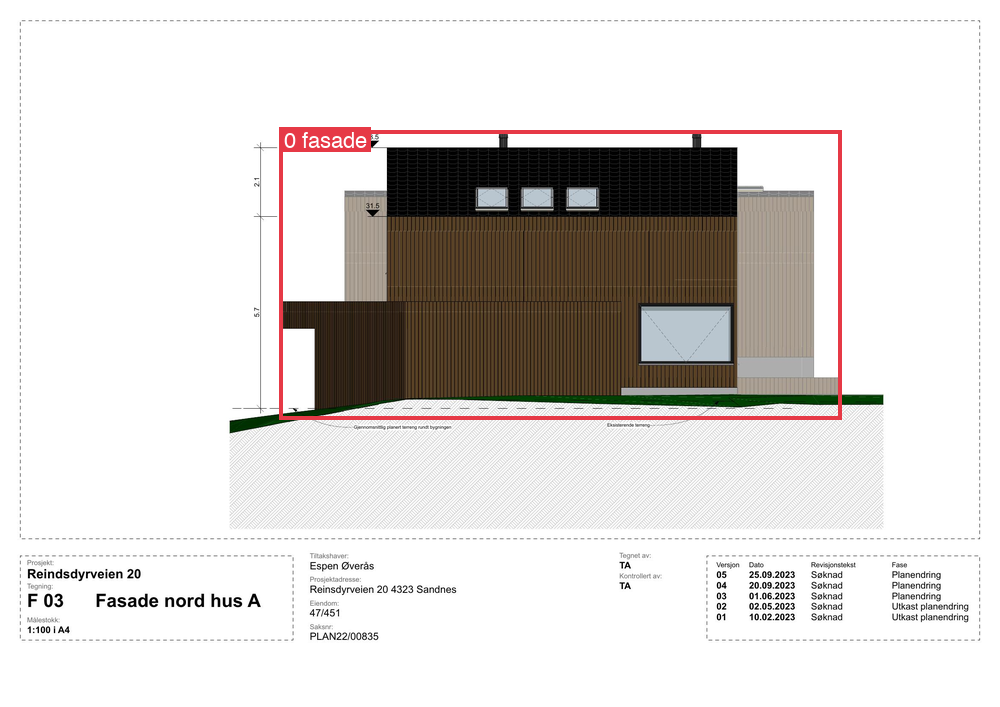
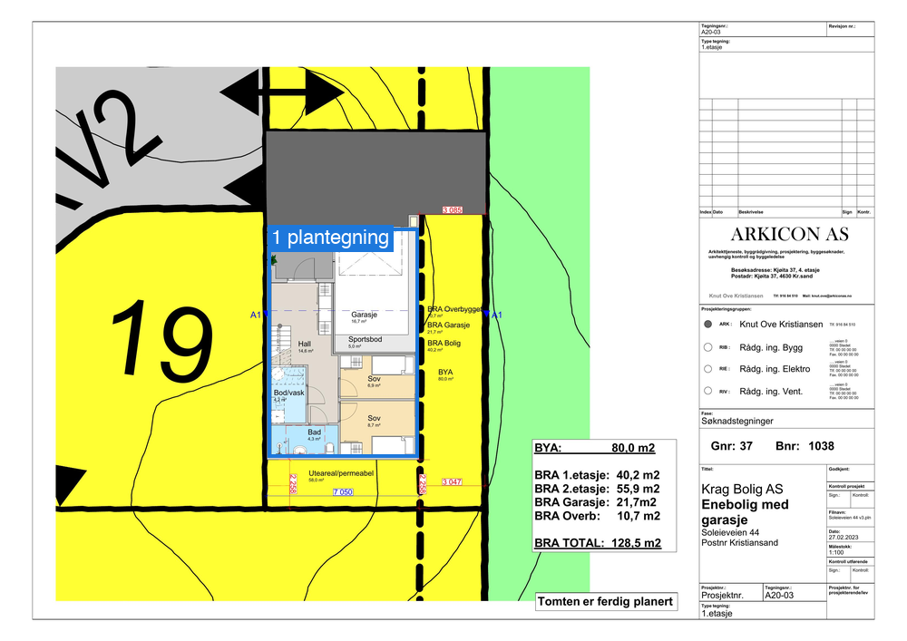
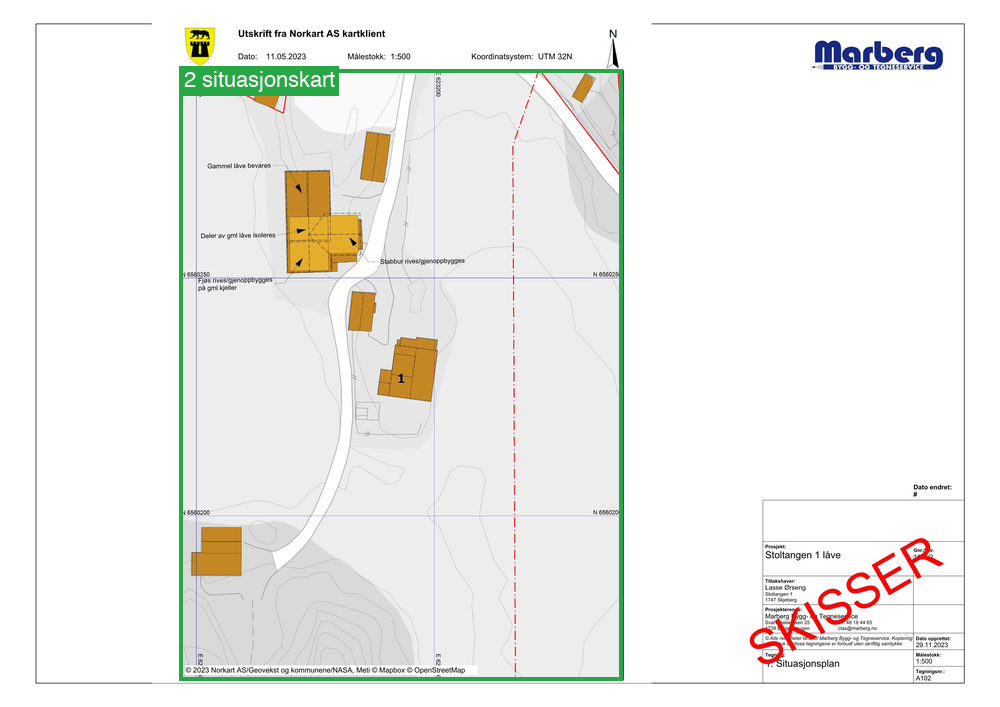
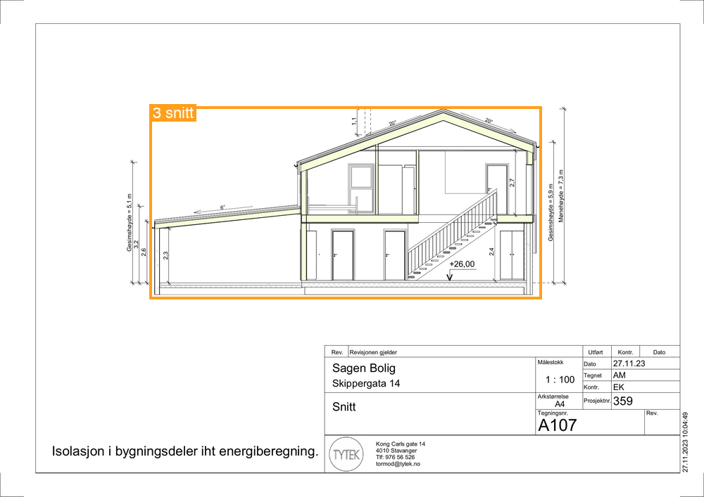
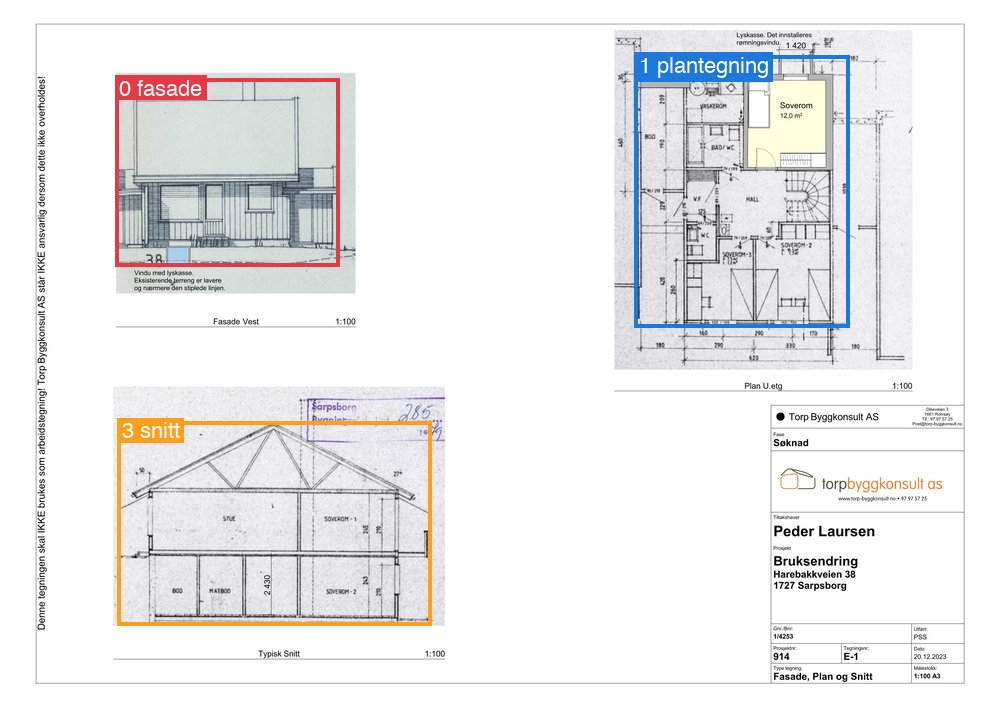
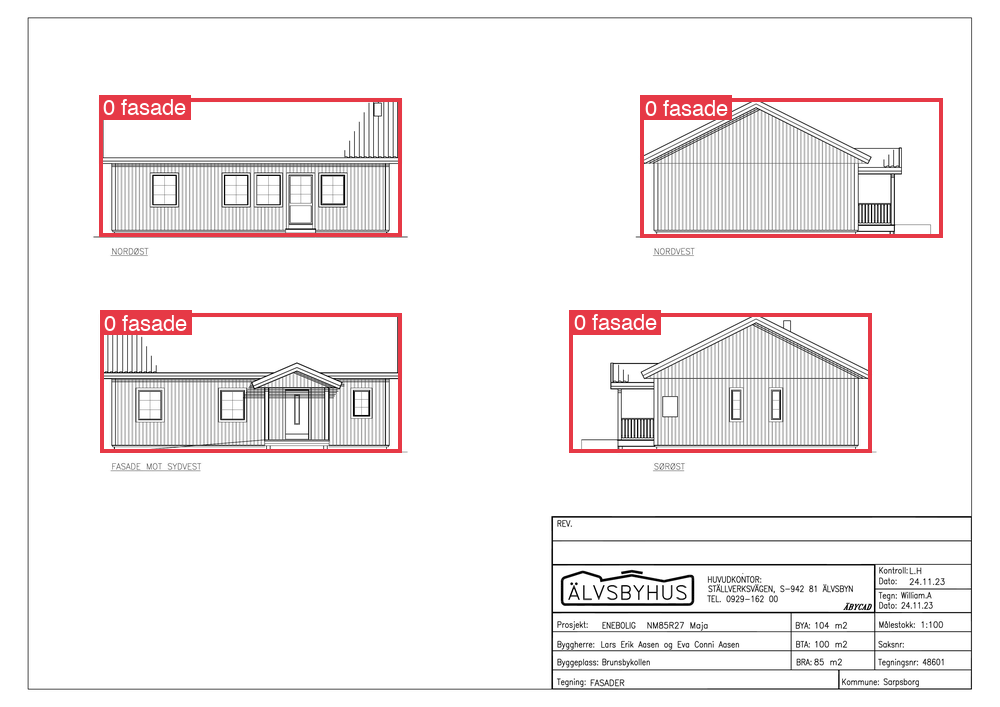
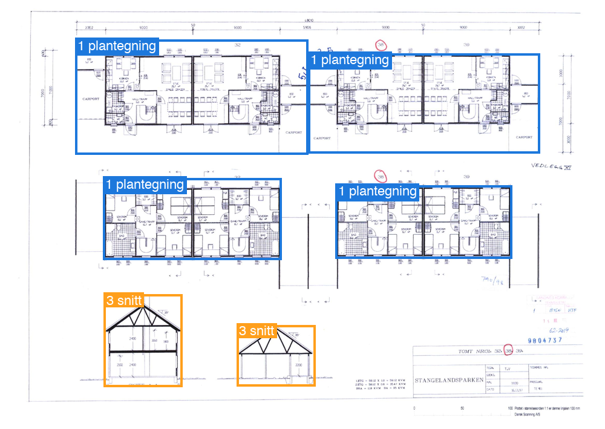
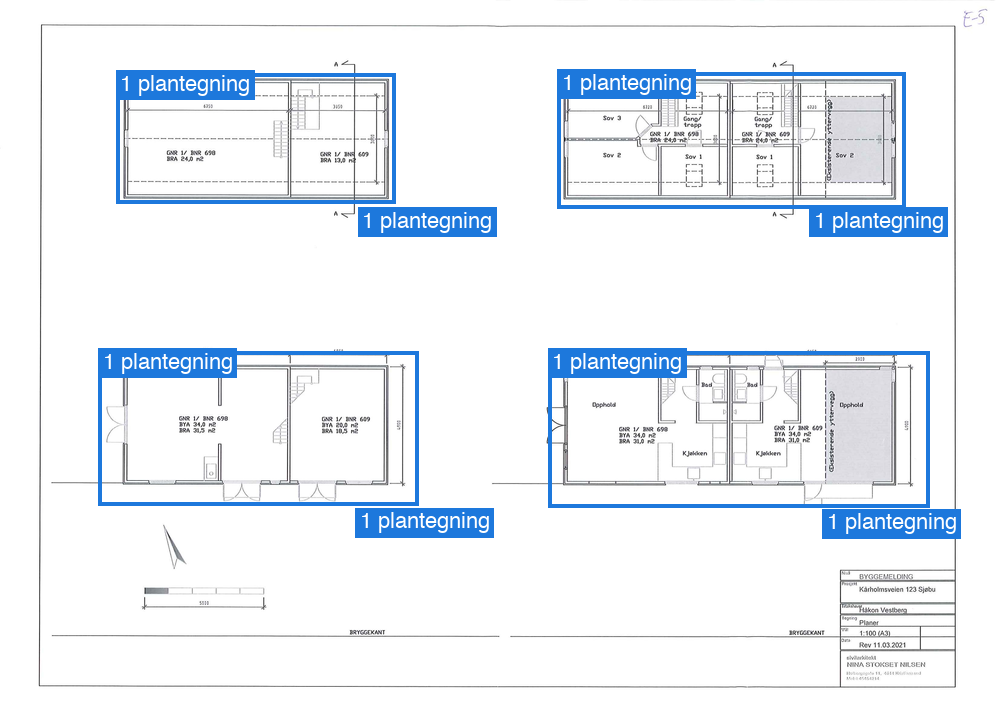
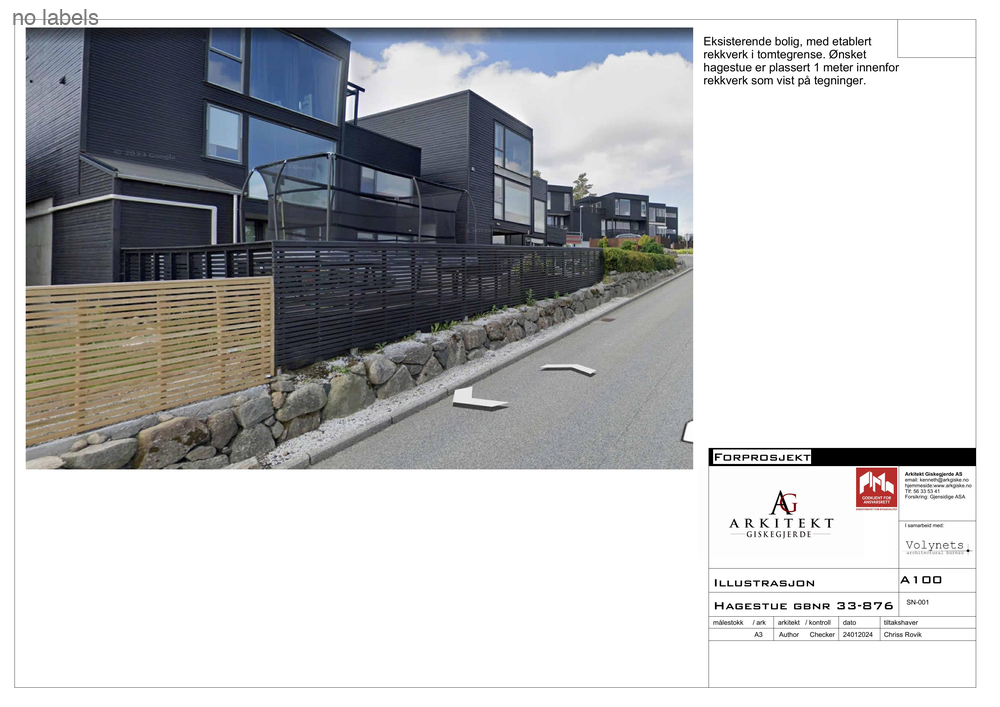

# CAD-AID benchmark

Benchmark for classifying and detecting drawing types on pages of Norwegian building-application drawings. Score your own model without learning the dataset layout.

| id | class |
|----|-------|
| 0 | `fasade` (elevation) |
| 1 | `plantegning` (floor plan) |
| 2 | `situasjonskart` (site plan) |
| 3 | `snitt` (section) |

1134 page images: 911 train, 116 val, 107 test. 161 images contain none of the classes. Every image has zero or more labelled drawings, each with a class and a bounding box.

## Samples

Boxes are coloured by class: 🟥 `fasade`, 🟦 `plantegning`, 🟩 `situasjonskart`, 🟧 `snitt`. Pages range from a single drawing to several, from one to three classes, and some have none.

| | | |
|:-:|:-:|:-:|
| <br>1 label: fasade | <br>1 label: plantegning | <br>1 label: situasjonskart |
| <br>1 label: snitt | <br>3 labels, 3 classes | <br>4 labels: fasade ×4 |
| <br>6 labels: plantegning ×4, snitt ×2 | <br>8 labels: plantegning ×8 | <br>0 labels (negative page) |

Regenerate with `uv run tools/make_samples.py`.

## Quick start

Requires [uv](https://docs.astral.sh/uv/).

```sh
uv run benchmark.py --template preds.json --split test      # 1. make a fill-in file
# 2. fill preds.json with your model's output
uv run benchmark.py --predictions preds.json --split test   # 3. score it
```

Or let the script call your model: `uv run benchmark.py --predictor examples/my_model.py:predict`.

Predictions can be just class names per image (classification only) or include scores and bounding boxes (adds detection metrics such as mAP). See [docs/how-to-benchmark.md](docs/how-to-benchmark.md) for the formats, metrics and options.

## Layout

```
benchmark.py          the benchmark (single-file uv script, no dependencies)
data/
  labels.json         all annotations
  images/             all page images
  VERSION             dataset version, printed in every report
docs/
  how-to-benchmark.md user guide
  dataset.md          how the data was assembled and labeled
examples/             sample prediction files and a predictor stub
tools/make_samples.py  renders the annotated sample images in docs/samples/
tools/viewer.html     label browser (serve the repo root, e.g. python3 -m http.server, open /tools/viewer.html)
```

## Dataset

How the data was assembled and labeled: see [docs/dataset.md](docs/dataset.md).

## Results

> TODO: reference results.
